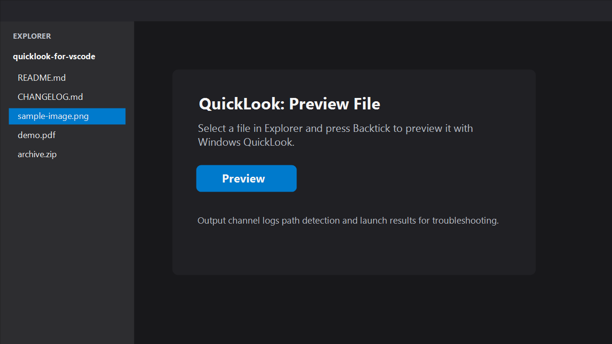
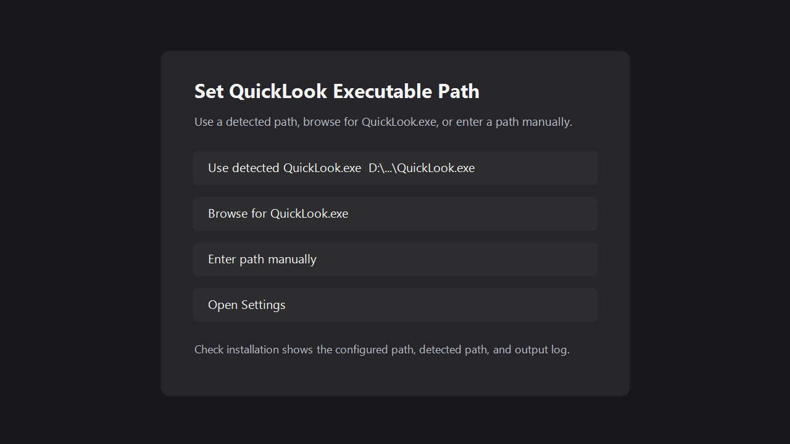

# Preview All-in-One with QuickLook

Preview many local file types from VS Code through the Windows [QuickLook](https://github.com/QL-Win/QuickLook) app.

> 中文文档：[README.zh-CN.md](README.zh-CN.md)

## Features

- Preview selected local files in the native Windows QuickLook preview window.
- Use the editor title button to preview the active local file without leaving the editor.
- Use the default Explorer keybinding `` ` `` to preview the selected file quickly.
- Run from Explorer context menus, editor context menus, editor title menus, and the Command Palette.
- Check your QuickLook setup with `QuickLook: Check QuickLook Installation`.
- Configure the QuickLook executable with `QuickLook: Set QuickLook Executable Path`.
- Choose a detected QuickLook path, browse for `QuickLook.exe`, or enter a path manually.
- Pass official QuickLook command line options such as `/pin` and `/top`.
- Inspect troubleshooting details in the `QuickLook` output channel.

## Preview All-in-One Coverage

This extension uses your local QuickLook installation as the preview engine. That makes VS Code Explorer and editor tabs a fast all-in-one preview entry point instead of another single-format viewer.

Examples from QuickLook's official supported formats:

| Category | Examples |
| --- | --- |
| Text and code | `.txt`, `.log`, `.json`, `.xml`, `.yaml`, `.md`, `.csv`, `.py`, `.js`, `.ts`, `.go`, `.rs`, `.sql` |
| Images and design assets | `.jpg`, `.png`, `.gif`, `.webp`, `.svg`, RAW images, `.psd`, `.ai`, `.fig`, `.sketch`, `.xd`, `.drawio` |
| Documents | `.pdf`, Word, Excel, PowerPoint, OpenDocument, Visio |
| Archives and packages | `.zip`, `.7z`, `.rar`, `.tar`, `.vsix`, `.whl`, `.jar`, comic archives |
| Markdown and data | Markdown variants, Mermaid, `.csv`, `.tsv` |
| Fonts | `.ttf`, `.otf`, `.woff`, `.woff2`, `.ttc` |
| Media, web and mail | Common video/audio formats, `.html`, `.mhtml`, `.url`, `.eml`, `.msg` |
| Binaries and installers | `.exe`, `.dll`, `.msi`, `.msix`, `.apk`, `.deb`, `.rpm` |
| QuickLook plugins | OfficeViewer, PdfViewer-Native, PostScriptViewer, CADImport, and more |

Actual preview support depends on your installed QuickLook version and QuickLook plugins. See the official QuickLook resources for the current format list:

- [QuickLook README](https://github.com/QL-Win/QuickLook)
- [QuickLook supported formats](https://github.com/QL-Win/QuickLook/blob/master/SUPPORTED_FORMATS.md)

## Screenshots





## Requirements

- Windows.
- VS Code 1.91.0 or later.
- QuickLook for Windows installed and available locally.

Install QuickLook from the official repository: <https://github.com/QL-Win/QuickLook>

## Usage

1. Install and start QuickLook.
2. Select a local file in VS Code Explorer, or open a local file in the editor.
3. Press `` ` ``, click the editor title preview button, or run `QuickLook: Preview with QuickLook` from the Command Palette.

The default `` ` `` keybinding only applies when VS Code Explorer has focus, so it does not override normal typing in the editor. You can bind `QuickLook: Preview with QuickLook` to any key or key combination in VS Code Keyboard Shortcuts.

## Commands

| Command | Description |
| --- | --- |
| `QuickLook: Preview with QuickLook` | Preview the selected or active local file with QuickLook. |
| `QuickLook: Check QuickLook Installation` | Check the configured path, detected path, and setup status. |
| `QuickLook: Set QuickLook Executable Path` | Use a detected path, browse for `QuickLook.exe`, enter a path manually, or open settings. |

## Settings

```json
{
  "quicklook.executablePath": "D:\\Program Files\\QuickLook\\QuickLook.exe",
  "quicklook.previewOptions": [],
  "quicklook.useExplorerClipboardFallback": true
}
```

### `quicklook.executablePath`

The QuickLook executable command or full path. This local build defaults to:

```text
D:\Program Files\QuickLook\QuickLook.exe
```

If QuickLook is installed somewhere else, run `QuickLook: Set QuickLook Executable Path` and choose one of these options:

- Use a detected `QuickLook.exe` path.
- Browse for `QuickLook.exe`.
- Enter the full path manually.
- Open VS Code settings.

### `quicklook.previewOptions`

Additional command line options appended after the file path. Official QuickLook options include `/pin` and `/top`.

```json
{
  "quicklook.previewOptions": ["/top"]
}
```

### `quicklook.useExplorerClipboardFallback`

When a keybinding is triggered from Explorer, VS Code's stable API does not directly expose the focused Explorer selection. This extension can temporarily call VS Code's Copy Path command, read the selected path, and restore the previous clipboard text immediately.

Disable this setting if you do not want the extension to use that fallback.

## Troubleshooting

1. Run `QuickLook: Check QuickLook Installation`.
2. If QuickLook is not found, choose `Set Path` and select or enter your `QuickLook.exe` path.
3. Open the `QuickLook` output channel for detailed path resolution and launch logs.

If preview still fails, confirm that QuickLook itself can preview the same file outside VS Code.

## Development

```powershell
npm install
npm test
npm run package
```

`npm run package` cleans old VSIX files before producing the latest package.

Press `F5` in VS Code to launch an Extension Development Host.

## Release Notes

See [CHANGELOG.md](CHANGELOG.md).

## Publishing

See [docs/dev/2-release-process.md](docs/dev/2-release-process.md) for the GitHub and Visual Studio Marketplace release flow.

## License

This project is licensed under the GNU Affero General Public License v3.0 only. See [LICENSE.txt](LICENSE.txt).