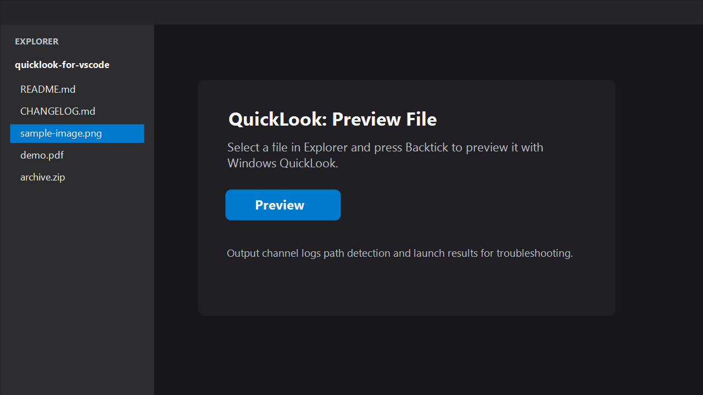
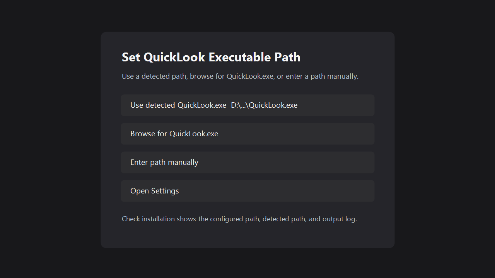

# Preview All-in-One with QuickLook

Preview files from VS Code through the Windows [QuickLook](https://github.com/QL-Win/QuickLook) app.

> 中文文档：[README.zh-CN.md](README.zh-CN.md)

## Highlights

- Press ``Alt+` `` or use the editor-title button to preview the focused file.
- Works from Explorer, editor tabs, Search Results, Source Control, Git Diff and History, and the Command Palette.
- Uses your local QuickLook installation, including its installed format plugins.
- Resolves the correct Git version for working, staged, deleted, Diff, and History files.
- Keeps Markdown in your last source-only, preview-only, or source-and-preview workflow.

## Screenshots

## Requirements

- Windows
- VS Code 1.119.0 or later
- [QuickLook for Windows](https://github.com/QL-Win/QuickLook), installed and running

## Quick start

1. Install and start QuickLook.
2. Select a file in Explorer or Source Control, or focus an open local or Git file.
3. Press ``Alt+` ``, click the Preview button, or run `QuickLook: Preview with QuickLook`.

If QuickLook is not detected, run `QuickLook: Set QuickLook Executable Path`.

### Source Control versions

| Context | Previewed version |
| --- | --- |
| Changes and Untracked | Working copy |
| Staged Changes | Git index |
| Deleted files | Last version that still exists |
| Diff and History editors | Currently focused side |

The context-clicked row wins when multiple SCM rows are selected. Git versions are copied to version-labelled temporary files and removed after ten minutes or when the extension stops.

## Markdown workflow

Markdown files reuse the last view selected in the current workspace:

| View | Layout |
| --- | --- |
| `preview` | One group with VS Code's native rendered Preview |
| `source` | One group with the source editor or native SCM Diff |
| `split` | Source or Diff in Group 1 and live Preview in Group 2 |

Use VS Code's native **Open as Preview**, **Reopen as source file**, and **Open Preview to the Side** actions to select these views. Closing one side of `split` keeps the remaining view. Non-Markdown Diff, Untitled, Merge Editor, and unsupported custom editors retain native behavior.

The workflow is enabled by default. Set `quicklook.markdownViewContinuity.enabled` to `false` to stop view memory and automatic layout changes. VS Code's native `*.md` Preview association remains active; explicitly associate `*.md` with `default` in `workbench.editorAssociations` if you also want source to be the default editor.

Split follows `workbench.editor.openSideBySideDirection`:

- `right`: source on the left and Preview on the right.
- `down`: source above Preview; recommended when VS Code occupies half of a display.

To use the stacked layout, open Settings with `Ctrl+,`, search for `workbench.editor.openSideBySideDirection`, and select `down`.

## Commands

| Command | Purpose |
| --- | --- |
| `QuickLook: Preview with QuickLook` | Preview the selected or active file. |
| `QuickLook: Check QuickLook Installation` | Check path resolution and installation status. |
| `QuickLook: Set QuickLook Executable Path` | Detect, browse for, or enter `QuickLook.exe`. |

## Settings

| Setting | Default | Purpose |
| --- | --- | --- |
| `quicklook.executablePath` | `QuickLook.exe` | Resolve QuickLook from `PATH` and common Installer/Scoop locations, or use an explicit custom path. |
| `quicklook.previewOptions` | `[]` | Additional QuickLook options such as `/pin` or `/top`. |
| `quicklook.useExplorerClipboardFallback` | `true` | Resolve Explorer keyboard selection through a temporary Copy Path operation, then restore the clipboard. |
| `quicklook.markdownViewContinuity.enabled` | `true` | Remember and reuse the workspace Markdown view. |
| `quicklook.markdownInitialView` | `preview` | Initial `preview`, `source`, or `split` view when no workspace view is stored. |

## Supported formats

QuickLook commonly supports text and code, images, PDF and Office documents, archives, fonts, media, mail, design assets, and other formats. Actual coverage depends on your QuickLook version and installed plugins; see the official [supported-formats list](https://github.com/QL-Win/QuickLook/blob/master/SUPPORTED_FORMATS.md).

## Troubleshooting

1. Run `QuickLook: Check QuickLook Installation`.
2. Correct the executable path if needed.
3. Open the `QuickLook` output channel for launch details.
4. Confirm that QuickLook itself can preview the same file outside VS Code.

For support, see the [support guide](https://github.com/occasional16/quicklook-for-vscode/blob/main/SUPPORT.md).

## Development and release

Run `npm test` to compile and test. See the [release guide](https://github.com/occasional16/quicklook-for-vscode/blob/main/docs/release.md) for packaging and publishing.

## License

[GNU Affero General Public License v3.0 only](LICENSE.txt)
